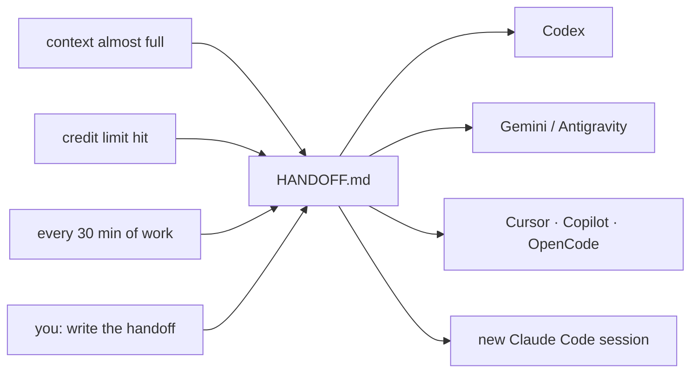

<div align="center">


# handoff

**Never lose your work when the tokens run out.**

One skill for every coding agent. It writes a `HANDOFF.md` that any other agent can pick up.

[](https://agentskills.io)
[](#which-tool-does-what)
[](https://www.python.org/)
[](#install)

</div>

---

## The problem

Your context window fills up. Your credit runs out. The session expires. Everything the agent knew — the goal, the plan, the three things it already tried — is gone, and your next session starts from zero.

Your tool's own compacting or memory doesn't help here: it stays inside that one tool. When you move from Claude Code to Codex, or to Gemini, or just to a new session tomorrow, nothing travels with you.

## The fix

The agent keeps one plain Markdown file **in the folder you are working in**:

```
HANDOFF.md    goal · where we stopped · next steps · decisions · what failed · repo snapshot
```

Then, in any other tool, you say:

> **Read HANDOFF.md and continue.**



## Install

```bash
git clone https://github.com/chentaymane/handoff
cd handoff
python install.py --hooks --rules
```

That's it. The skill is copied to every place your agents look for skills:

| Folder | Read by |
|---|---|
| `~/.claude/skills/handoff` | Claude Code (OpenCode too) |
| `~/.agents/skills/handoff` | Codex, Gemini CLI, Cursor, GitHub Copilot, OpenCode, Amp, Goose |
| `~/.gemini/config/skills/handoff` | Antigravity (IDE, app and CLI) |

| Option | What it adds |
|---|---|
| `--hooks` | The Claude Code hook: context warnings, credit-limit alerts, 30-minute checkpoints |
| `--window 1000000` | Tell the hook your context window is 1M instead of 200K |
| `--rules` | Two lines in `~/.claude/CLAUDE.md`, `~/.codex/AGENTS.md`, `~/.gemini/GEMINI.md` and `~/.config/opencode/AGENTS.md`, so agents look for `HANDOFF.md` when a session starts |
| `--dry-run` | Show what would change, change nothing |
| `--uninstall` | Remove all of it (your own settings are restored untouched) |

The skill is **copied**, not linked, so run the installer again after you change it. For one project only, copy the `handoff` folder to `<project>/.agents/skills/handoff` or `<project>/.claude/skills/handoff`.

## Use it

| Tool | Ask for a handoff |
|---|---|
| Claude Code | `/handoff` |
| Codex | `$handoff` |
| GitHub Copilot | `/handoff` |
| Gemini CLI, Antigravity, Cursor, OpenCode, others | "write the handoff" |

To continue anywhere: open the project and say **"Read HANDOFF.md and continue."** The agent reads the file, checks it against the real repo with `git status`, tells you in two lines where things stand, and carries on from "Next steps".

You don't always have to ask. The agent writes or updates the file by itself when:

- **the budget is running low** — a token counter, a context or usage warning, or the Claude Code hook;
- **a request just failed on a usage or credit limit** — then it writes immediately, because the next request may not go through;
- **it finishes a milestone**, or ~30 minutes of work have passed since the last update;
- **it stops with work unfinished.**

## Which tool does what

Being honest about it: only Claude Code can *measure* its own situation, because only it has hooks that can talk to the model. Everywhere else the skill still works — it triggers on warnings the agent can see, on milestones, and when you ask.

| Tool | Skill works | Automatic warnings | Looks for HANDOFF.md at startup |
|---|---|---|---|
| Claude Code | yes | **yes** — context 60% / 75%, credit limits, 30-min checkpoints | yes (hook) |
| Codex | yes | no — hooks are experimental and don't run on Windows | yes, with `--rules` |
| Gemini CLI | yes | no — its `PreCompress` hook can't send a message to the model | yes, with `--rules` |
| Antigravity | yes | no | yes, with `--rules` |
| OpenCode | yes | no | yes, with `--rules` |
| Cursor | yes | no | add the two lines to Settings → Rules → User Rules |
| GitHub Copilot | yes | no | add the two lines to a project `AGENTS.md` |

### What about credit limits and expired sessions?

No tool warns the model *before* your credit runs out or a session expires — the agent genuinely cannot see it coming. So this is handled from three sides:

1. **Checkpoints.** Every ~30 minutes of real work, the hook asks Claude to refresh `HANDOFF.md` in your working folder. Whatever happens next, the file is at most that old. (`HANDOFF_CHECKPOINT_MIN`, `0` turns it off.)
2. **The moment a limit bites.** A usage or credit limit leaves a `rate_limit` error in the session transcript. The hook spots it and tells Claude to write the handoff before anything else, while it still can.
3. **Recovery, if nothing was written.** The conversation is still on disk. From the project folder:

   ```bash
   python ~/.claude/skills/handoff/scripts/recover.py
   ```

   It prints a short digest of the dead session — what you asked for, what was done, which errors hit, whether it ended on a credit limit — and any agent can turn that into a proper `HANDOFF.md`. Add `--list` to pick a different session.

## What's in HANDOFF.md

It is written for an agent that has never seen your conversation: exact file paths, commands, and error messages copied word for word — no "as we discussed".

| Section | What it holds |
|---|---|
| **Goal** | What we're building and what "done" means |
| **Where we stopped** | The exact file, command, error, and any half-finished edit |
| **Next steps** | Ordered actions, the first one ready to run |
| **Done so far** | What's finished and how it was checked |
| **Decisions and constraints** | Choices and their reasons, so nobody undoes them |
| **Tried and failed / gotchas** | Dead ends, so nobody repeats them |
| **Key files** · **How to run and verify** · **Open questions** | The rest of what a newcomer needs |
| **Repo snapshot** | Branch, recent commits and uncommitted files, added automatically |

<details>
<summary>See a real example</summary>

[HANDOFF.md](HANDOFF.md) in this repo is not a sample — it's the handoff written while building this skill, by the agent that built it.

</details>

## The Claude Code hook

`handoff/scripts/context_monitor.py` watches the session and speaks to Claude at the right moment:

| When | What Claude is told |
|---|---|
| context 60% full | Write HANDOFF.md at the next natural pause |
| context 75% full | Write HANDOFF.md now, before anything else |
| a `rate_limit` error appears | A usage or credit limit hit — write the handoff immediately |
| 30 minutes since the last update | Refresh "Where we stopped" and "Next steps" |
| after auto-compaction | Re-read HANDOFF.md, details may have been summarized away |
| session start | This project has an unfinished HANDOFF.md |

| Setting | Default | Meaning |
|---|---|---|
| `HANDOFF_CONTEXT_WINDOW` | `200000` | Your context window. It switches to 1M by itself once usage passes 200K |
| `HANDOFF_SOFT_PCT` | `60` | First context reminder |
| `HANDOFF_URGENT_PCT` | `75` | Urgent context reminder |
| `HANDOFF_CHECKPOINT_MIN` | `30` | Minutes between checkpoints (`0` disables them) |

Put them in the `env` block of `~/.claude/settings.json`. The hook adds about 0.3 s per tool call on Windows (Python start-up); if you'd rather not pay that, delete its `PostToolUse` entry and keep the check that runs when you send a message.

## What's in this repo

```
handoff/
  SKILL.md                     the skill: when to write, what to write, how to resume
  scripts/snapshot.py          adds the repo snapshot into HANDOFF.md
  scripts/context_monitor.py   Claude Code hook: context, credit limits, checkpoints
  scripts/recover.py           rebuilds a handoff from a session that died
install.py                     installer for every tool
assets/logo.svg
HANDOFF.md                     a real handoff (this project's own)
```

## Questions

**Does it overwrite my project's README?** Never. The file is always `HANDOFF.md`, in the folder you're working in.

**Is HANDOFF.md committed?** Not by itself — the agent asks you first. Commit it when you want to continue on another computer.

**My session died and there's no handoff — what now?** Run `recover.py` (see [above](#what-about-credit-limits-and-expired-sessions)) and let the agent rebuild it from the transcript.

**Can it leak my secrets?** The skill is told never to write keys, tokens or passwords into the file, and the snapshot removes passwords from git remote URLs.

**One file per project or many?** One. Each session updates the same file instead of piling up new ones.

**Do I need Python?** Only for the installer, the snapshot script, the hook and recovery. The skill itself is just Markdown and works without it.

**How do I remove everything?**

```bash
python install.py --uninstall
```
