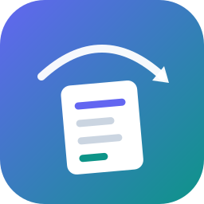
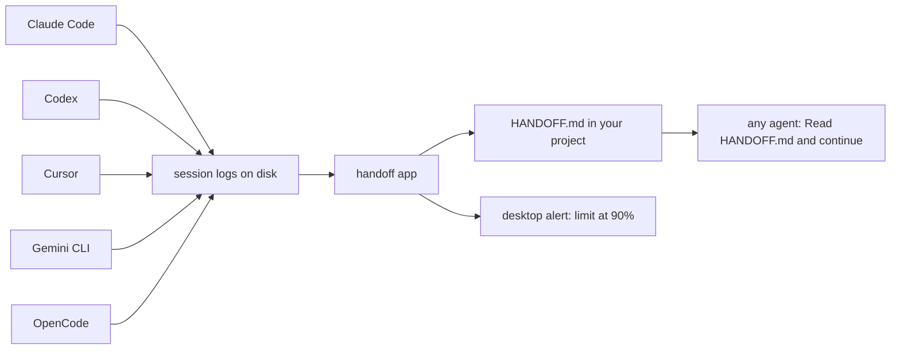

<div align="center">



# handoff

**Never lose your work when the tokens run out.**

A small background app that watches your coding agents (Claude Code, Codex, Cursor, Gemini CLI and OpenCode) and keeps a `HANDOFF.md` in every project, so when the context fills up, the credit runs out or the session dies, any agent can pick up exactly where you stopped.

[](https://www.python.org/)
[](pyproject.toml)
[](#what-it-reads)
[](#install)

</div>

---

## Why an app

Prompts, rules and skills only work while the agent is alive and remembers to use them. When your credit runs out, the agent is already gone, and so is everything it knew.

`handoff` doesn't ask the agent for anything. Every coding agent already saves its conversation to disk as it works. `handoff` reads those logs **from the outside** and writes the handoff itself, which is why it still works after the session has died.



## What it does

- **Keeps `HANDOFF.md` current.** After every step an agent finishes, the file in that project is refreshed: goal, where it stopped, the agent's own plan, files changed, commands, errors, repo state.
- **Sees the limit coming.** Codex records how much of its usage limit is used. At **80%** and **95%**, `handoff` writes the handoff immediately and shows a desktop notification, before the credit is gone.
- **Catches the cut-off.** When Claude Code, Cursor, OpenCode or Gemini CLI hits a usage limit or quota, or a context window passes 70% and 85%, it writes the handoff at once and alerts you.
- **Rescues dead sessions.** `handoff now` rebuilds the handoff from the log of a session that already ended.
- **Stays out of your way.** It only writes its own marked section, masks API keys and passwords, and never writes into your home folder, temp folders or agent settings.

## Install

Python 3.8 or newer. Nothing else.

```bash
git clone https://github.com/chentaymane/handoff
cd handoff
python -m handoff status
```

That already works from the folder. To get a `handoff` command you can run anywhere:

```bash
pip install .
```

Then start it once, and have it start by itself from now on:

```bash
handoff start
handoff autostart on
```

## Commands

| Command | What it does |
|---|---|
| `handoff status` | Your recent agent sessions: context used, usage limit, how old each project's HANDOFF.md is, and whether the watcher runs |
| `handoff now` | Write HANDOFF.md for the current folder from its latest session, whichever agent it was (`--print` to only show it) |
| `handoff now FOLDER --from LOG` | Rebuild a handoff from one specific session log |
| `handoff start` / `handoff stop` | Run the watcher in the background / stop it |
| `handoff watch` | Run the watcher in this window, to see what it does |
| `handoff autostart on` / `off` | Start the watcher when you log in |

```
$ handoff status
Watcher:    running (pid 18244)
Autostart:  on
Reads:      Claude Code, Codex, Gemini CLI, Cursor, OpenCode

LAST ACTIVE       TOOL         CONTEXT       USAGE LIMIT  HANDOFF.md  FOLDER
2026-09-16 15:38  Claude Code  55% of 1000K  -            1 min old   C:\Users\you\Desktop\shop-api
2026-09-16 14:02  Codex        40% of 258K   87% 30-day   3 min old   C:\Users\you\Desktop\uploader
2026-09-16 11:20  Cursor       41% of 200K   LIMIT HIT    9 min old   C:\Users\you\Desktop\insta-bot
2026-09-15 23:54  OpenCode     39% of 200K   -            2 h old     C:\Users\you\Desktop\scraper
```

## What it reads

| Tool | Where | Context | Usage limit |
|---|---|---|---|
| **Codex** (CLI, IDE extension, app) | `~/.codex/sessions` | exact | **percentage before you hit it**, with its reset time |
| **Claude Code** (CLI, desktop, IDE) | `~/.claude/projects` | measured, window size assumed | when a limit is hit |
| **Cursor** | `~/.cursor/projects/*/agent-transcripts` and Cursor's `state.vscdb` | exact | when a limit is hit |
| **OpenCode** | `~/.local/share/opencode/opencode.db` | measured | when a limit is hit (HTTP 429) |
| **Gemini CLI** | `~/.gemini/tmp/*/chats` | measured | when a quota is hit |
| Antigravity | — | stores conversations in a binary format, not readable yet | — |

Only Codex writes its usage percentage into its logs, so it's the one tool where `handoff` can warn you *before* the credit runs out. For the others, the handoff is kept fresh after every step, so it's already written when the limit arrives.

The Gemini CLI reader is built from Gemini CLI's source and tested with sample logs; the others were tested on real sessions.

## What HANDOFF.md looks like

<details>
<summary>An example from a Codex session at 91% of its usage limit</summary>

```markdown
# HANDOFF: shop-api

> **Next agent:** read this file, check it against the repo with `git status`, then continue
> from "Next steps". The section below is updated automatically from the latest coding session
> in this folder; notes added outside it are kept.

<!-- handoff:auto:start -->
## Auto handoff

_Last update: 2026-09-16 15:42 +0100, from a **Codex** session (gpt-5.5)._

**Heads-up:** 91% of the usage limit is used.

### Goal
> Add Stripe checkout to the cart page and email a receipt after payment

### Where we stopped
> Checkout works end to end in test mode. The receipt email is wired up,
> but the template still has placeholder text.

### Plan
- [x] Create the checkout session endpoint
- [x] Redirect the cart page to Stripe
- [ ] **Send the receipt email** _(in progress)_
- [ ] Handle failed payments

### Next steps
1. Send the receipt email
2. Handle failed payments

### Files changed in this session
- `src/routes/checkout.ts` - added
- `src/pages/cart.tsx` - edited
- `src/emails/receipt.html` - added

### Session
- **Tool:** Codex (gpt-5.5), 48 tool calls
- **Context:** ~142K of 258K tokens (55%)
- **Usage limit:** 91% used of the 5-hour window, resets 2026-09-16 17:30

### Repo
- **Branch:** `feature/checkout` @ `4be21c9` - Add checkout session endpoint
- **Uncommitted:** 3 changed, 1 untracked
<!-- handoff:auto:end -->
```

</details>

Open the project in any agent and say **"Read HANDOFF.md and continue."**

## How it decides

- It checks the logs every 5 seconds and only acts on sessions that are active **after** it started, so it never fills old projects with files.
- It writes once an agent has been quiet for 20 seconds (a step just finished), so the file is at most one step behind.
- It writes immediately, and alerts once per level, when a usage limit or the context window crosses a threshold.
- It only writes for real work: at least one changed file, three commands, or two requests.
- It never writes into your home folder, a drive root, a temp folder or an agent's settings folder. Put an empty `.nohandoff` file in any project to keep it out.
- It owns only the lines between `<!-- handoff:auto:start -->` and `<!-- handoff:auto:end -->`. You and your agents can write anything above or below, and it's kept.
- It masks secrets before writing: `sk-`, `ghp_`, `AKIA`, `AIza` and `xox` keys, JWTs, `password=`-style values, and credentials in URLs.
- It opens agent databases read-only, so it can never block or change them.

Its own files live in `~/.handoff`: `handoff.log`, `state.json` and `watch.pid`. Set `HANDOFF_HOME` to put them elsewhere.

## Extras

`extras/skills/handoff` is an optional [Agent Skill](https://agentskills.io). It lets a live agent write a richer, hand-written handoff above the app's section, including decisions and dead ends that no log shows. `python extras/install_skill.py` installs it for Claude Code, Codex, Gemini, Antigravity, Cursor, Copilot and OpenCode.

## Development

```bash
python -m unittest discover -s tests -t .
```

Each agent has one reader in `handoff/sources/` with the same three functions (`discover`, `read`, `folder`), so adding another agent means adding one file.

## Uninstall

```bash
handoff stop
handoff autostart off
pip uninstall handoff-app
```

Then delete the `~/.handoff` folder.
