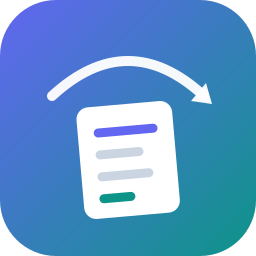
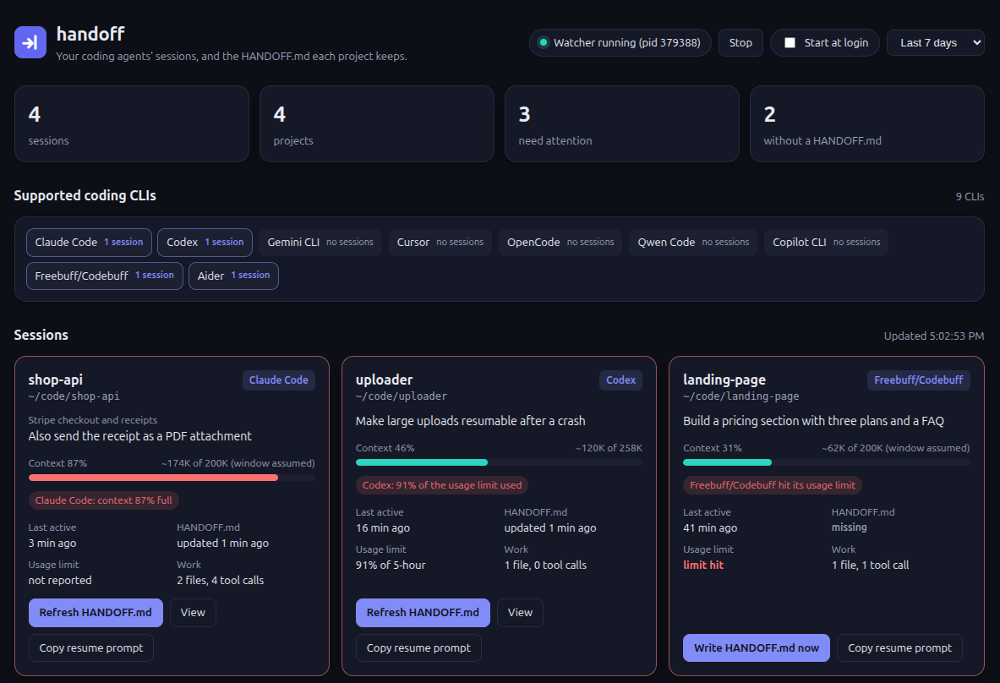
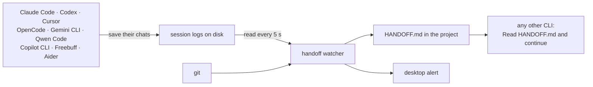

<div align="center">



# handoff

**Hit a limit in one coding CLI. Keep going in another, right where you stopped.**

`handoff` is a small background app that watches your AI coding agents and keeps a `HANDOFF.md` in every project: the goal, where the agent stopped, its plan, the files it changed and the state of the repo. When the context fills up, the credit runs out or the session dies, open the project in any other agent and say **"Read HANDOFF.md and continue."**

[](https://www.python.org/)
[](pyproject.toml)
[](#supported-clis)
[](#quick-start)

[Quick start](#quick-start) · [Supported CLIs](#supported-clis) · [Dashboard](#dashboard) · [How it works](#how-it-works) · [FAQ](#faq)



</div>

## The problem

You're deep into a task with Claude Code, and it stops: *usage limit reached*. Or Codex runs out of credit, Cursor's context is full, or the terminal crashes. The agent knew what it was doing, what it had tried and what came next, and all of that is gone. The next agent starts from zero.

Asking the agent to "write down where you are before you stop" doesn't work either, because a cut-off doesn't warn it.

**`handoff` works from the outside.** Every coding agent already saves its conversation to disk as it works. `handoff` reads those logs and writes the handoff itself, after every step, so it's already there when the limit hits, and it still works after the session is dead. It's an app, not a prompt, skill or plugin: nothing to add to your agents.

## Quick start

You need Python 3.8 or newer, and nothing else.

```bash
git clone https://github.com/chentaymane/handOff
cd handOff
python3 -m handoff install
```

That's it. `install`:

1. adds a `handoff` command (in `~/.local/bin` on Linux and macOS; on Windows, in a folder that's already on your PATH),
2. starts the watcher in the background,
3. makes the watcher start by itself every time you log in.

It works even where `pip install` is blocked, such as Ubuntu 24.04 and Debian 12. Keep the cloned folder, because the command runs from it. If you prefer pip: `pipx install .`, then `handoff start` and `handoff autostart on`.

Then just code as usual. When a session gets cut off:

```
cd your-project
<open any other coding CLI>
> Read HANDOFF.md and continue.
```

## Supported CLIs

| CLI | Where it reads | Context | Usage limit | Tested |
|---|---|---|---|---|
| **Claude Code** (CLI, desktop, VS Code, JetBrains) | `~/.claude/projects` | measured | when a limit is hit | ✅ real sessions |
| **Codex** (CLI, IDE extension, app) | `~/.codex/sessions` | exact | **% used before you hit it**, with reset time | ✅ real sessions |
| **Cursor** | `~/.cursor` transcripts and `state.vscdb` | exact | when a limit is hit | ✅ real sessions |
| **OpenCode** | `~/.local/share/opencode/opencode.db` | measured | when a limit is hit | ✅ real sessions |
| **Gemini CLI** | `~/.gemini/tmp/*/chats` | measured | when a quota is hit | 🧪 sample logs |
| **Qwen Code** | `~/.qwen/tmp/*/chats` | measured | when a limit or quota is hit | 🧪 sample logs |
| **GitHub Copilot CLI** | `~/.copilot/session-state` | when logged | when a rate limit is hit | 🧪 sample logs |
| **Freebuff** / **Codebuff** | `~/.config/manicode/projects` | measured | when credits run out | 🧪 sample logs |
| **Aider** | `.aider.chat.history.md` in each project | from its token report | when a rate limit is hit | 🧪 sample logs |

✅ tested on real sessions. 🧪 built from the tool's source code or published log format and tested on sample logs; please [open an issue](https://github.com/chentaymane/handOff/issues) if one misreads your sessions.

Only Codex writes its usage percentage into its logs, so it's the one CLI where `handoff` can warn you *before* you hit the limit (at 80% and 95%). For the others, `HANDOFF.md` is refreshed after every step, so it's already current when the limit arrives.

Not supported yet: Antigravity, which stores conversations in a binary format.

## What goes into HANDOFF.md

Everything the next agent needs, taken from the session log and from git:

| Section | What it contains |
|---|---|
| **Heads-up** | why it was written: limit hit, usage at 91%, context 87% full |
| **Goal** | your first request, the latest one, and the session's title |
| **Where we stopped** | the agent's last message, plus its own recap when it wrote one |
| **Plan** and **Next steps** | the agent's to-do list, with done and in-progress items marked |
| **Files changed** | from the agent's edits *and* from the commits it made, so changes done through shell commands aren't missed |
| **Recent commands** and **Errors seen** | what it ran, and what failed |
| **Session** | tool, model, context used, usage limit and reset time, path to the full log |
| **Repo** | branch, commit, ahead/behind, uncommitted files, commits made during the session |

<details>
<summary><b>See an example</b>: a Codex session at 91% of its usage limit</summary>

```markdown
# HANDOFF: shop-api

> **Next agent:** read this file, check it against the repo with `git status`, then continue
> from "Next steps". The section below is updated automatically from the latest coding session
> in this folder; notes added outside it are kept.

<!-- handoff:auto:start -->
## Auto handoff

_Last update: 2026-09-16 15:42 +0100, from a **Codex** session (gpt-5.5)._

**Heads-up:** 91% of the usage limit is used.

### Goal
> Add Stripe checkout to the cart page and email a receipt after payment

### Where we stopped
> Checkout works end to end in test mode. The receipt email is wired up,
> but the template still has placeholder text.

### Plan
- [x] Create the checkout session endpoint
- [x] Redirect the cart page to Stripe
- [ ] **Send the receipt email** _(in progress)_
- [ ] Handle failed payments

### Next steps
1. Send the receipt email
2. Handle failed payments

### Files changed in this session
- `src/routes/checkout.ts` - added
- `src/pages/cart.tsx` - edited
- `src/emails/receipt.html` - added

### Recent commands
- `npm test -- checkout`

### Session
- **Tool:** Codex (gpt-5.5), 48 tool calls
- **Context:** ~142K of 258K tokens (55%)
- **Usage limit:** 91% used of the 5-hour window, resets 2026-09-16 17:30

### Repo
- **Branch:** `feature/checkout` @ `4be21c9` - Add checkout session endpoint
- **Uncommitted:** 3 changed, 1 untracked
<!-- handoff:auto:end -->
```

</details>

`handoff` only owns the lines between its two markers. You and your agents can write anything above or below them, such as decisions or dead ends, and it's kept.

## Dashboard

```bash
handoff dashboard
```

Opens a local page in your browser, at `http://127.0.0.1:7788`, that refreshes every 5 seconds:

- **The watcher:** running or not, with a Start/Stop button and a "start at login" switch.
- **All 9 CLIs**, and how many sessions each one has.
- **One card per project:** which CLI, the goal and latest request, a context bar that turns orange at 70% and red at 85%, the usage limit, alerts, and how old its `HANDOFF.md` is.
- **Buttons:** write or refresh `HANDOFF.md` now, read it, or copy the prompt that resumes the work in another CLI.

The page is served by `handoff` itself, from your computer only. It reads and writes only in folders where one of your agents has worked, and it refuses requests from other websites.

## Commands

| Command | What it does |
|---|---|
| `handoff install` | Set everything up: the command, the watcher, start at login |
| `handoff uninstall` | Undo it all (your `HANDOFF.md` files are kept) |
| `handoff dashboard` | Open the dashboard (`--port 7788`, `--no-open`) |
| `handoff status` | Recent sessions in the terminal: context, usage limit, HANDOFF.md age |
| `handoff now` | Write `HANDOFF.md` for this folder now, from its latest session (`--print` to only show it) |
| `handoff now FOLDER --from LOG` | Rebuild a handoff from one specific session log |
| `handoff start` / `stop` | Start or stop the background watcher |
| `handoff watch` | Run the watcher in this terminal, to see what it does |
| `handoff autostart on` / `off` | Start the watcher at login, or not |

```
$ handoff status
Watcher:    running (pid 18244)
Autostart:  on
Reads:      Claude Code, Codex, Gemini CLI, Cursor, OpenCode, Qwen Code, Copilot CLI, Freebuff/Codebuff, Aider

LAST ACTIVE       TOOL               CONTEXT       USAGE LIMIT  HANDOFF.md  FOLDER
2026-09-29 16:59  Claude Code        87% of 200K   -            1 min old   /home/you/code/shop-api
2026-09-29 16:46  Codex              46% of 258K   91% 5-hour   1 min old   /home/you/code/uploader
2026-09-29 16:21  Freebuff/Codebuff  31% of 200K   LIMIT HIT    2 min old   /home/you/code/landing-page
2026-09-29 11:45  Aider              20% of 200K   -            5 h old     /home/you/code/scraper
```

## How it works


```mermaid
flowchart LR
    A["Claude Code · Codex · Cursor<br/>OpenCode · Gemini CLI · Qwen Code<br/>Copilot CLI · Freebuff · Aider"] -->|save their chats| L["session logs on disk"]
    L -->|read every 5 s| H["handoff watcher"]
    G["git"] --> H
    H --> F["HANDOFF.md in the project"]
    H --> N["desktop alert"]
    F --> X["any other CLI:<br/>Read HANDOFF.md and continue"]
```

When it writes:

- **After every step.** When an agent has been quiet for 20 seconds, it just finished a step, so `HANDOFF.md` is at most one step behind.
- **Right away, with a desktop alert,** when a limit or quota is hit, credits run out, the context passes 70% or 85%, or Codex's usage passes 80% or 95%. Each alert fires once per level.
- **Only for real work:** at least one changed file, three commands, two requests, or a limit hit.
- **Only for new activity:** sessions active after the watcher started. For a session that ended before, run `handoff now` in its folder.

Where it never writes: your home folder, a drive root, temp folders, and agents' settings folders. Put an empty `.nohandoff` file in a project to keep it out too.

## Privacy and safety

- **Nothing leaves your computer.** No account, no network calls, no telemetry. It reads files and writes files.
- **Secrets are masked** before writing: `sk-`, `ghp_`, `AKIA`, `AIza` and `xox` keys, JWTs, `password=`-style values, and credentials in URLs.
- **Agent data is read-only.** Databases are opened in read-only mode, so `handoff` can never block or change your agents.
- **Your notes are safe.** Only the section between the markers is ever rewritten.
- **The dashboard is local.** It listens on `127.0.0.1` only and refuses requests from other websites.

## Configuration

Nothing is required. These environment variables are optional:

| Variable | What it does |
|---|---|
| `HANDOFF_HOME` | Where `handoff` keeps its own files (default `~/.handoff`: `handoff.log`, `state.json`, `watch.pid`) |
| `HANDOFF_SCAN` | Folders to search for Aider projects, separated like `PATH` (default: your home folder and `Desktop`, `Documents`, `projects`, `code`, `src`, `dev`, `work`, `repos` and a few more, two levels deep) |
| `CODEX_HOME` | Codex's data folder, if you moved it |
| `FREEBUFF_CONFIG_DIR` | Freebuff's data folder, if you moved it |

## FAQ

<details>
<summary><b>Is this a skill, a plugin or an MCP server?</b></summary>

No. It's a standalone app that runs next to your agents. Skills and prompts only work while the agent is alive and remembers to use them; a usage limit gives it no chance to. `handoff` reads the logs agents already write, so it needs nothing from them.
</details>

<details>
<summary><b>Why does only Codex show a usage percentage?</b></summary>

Because only Codex writes it into its logs. Claude Code, Cursor and the others only say something once the limit is hit. For them, `handoff` keeps the file current after every step, so it's already written by then, and it alerts you the moment the limit message appears.
</details>

<details>
<summary><b>Do I need to keep a terminal open?</b></summary>

No. After `handoff install`, the watcher runs in the background and starts by itself when you log in. `handoff status` or the dashboard shows whether it's running.
</details>

<details>
<summary><b>A session ended before I installed handoff. Can I still get a handoff?</b></summary>

Yes. Run `handoff now` inside the project folder, or press **Write HANDOFF.md now** on its card in the dashboard. It rebuilds the handoff from that session's log.
</details>

<details>
<summary><b>Should I commit HANDOFF.md?</b></summary>

Your choice. Committing it lets a teammate or another machine pick up the work. If you'd rather not, add `HANDOFF.md` to `.gitignore`; `handoff` doesn't count it as an uncommitted change either way.
</details>

<details>
<summary><b>The context percentage for Claude Code says "window size assumed". Why?</b></summary>

Claude Code logs how many tokens are in use, but not how big the window is. `handoff` assumes 200K, and 1M once a session goes past 200K or the model name ends in `[1m]`. If the guess is too small, the only effect is that the handoff gets written a bit early.
</details>

## Add another CLI

Each CLI has one reader in [`handoff/sources/`](handoff/sources) with the same three functions:

```python
def discover(max_age_hours):  # yield (ref, stamp) for each session; stamp changes whenever the session does
def read(ref):                # return a Session: requests, replies, plan, files, commands, errors, tokens, limits
def folder(ref):              # the session's project folder, found cheaply
```

Add the module to `MODULES` in [`handoff/sources/__init__.py`](handoff/sources/__init__.py), add a test with a small sample log, and it shows up everywhere: the watcher, `handoff status` and the dashboard.

```bash
python3 -m unittest discover -s tests -t .
```

## Uninstall

```bash
handoff uninstall
```

This stops the watcher, turns off autostart and removes the `handoff` command. Your `HANDOFF.md` files stay. Then delete the cloned folder and `~/.handoff`. If you installed with pip, also run `pip uninstall handoff-app`.
