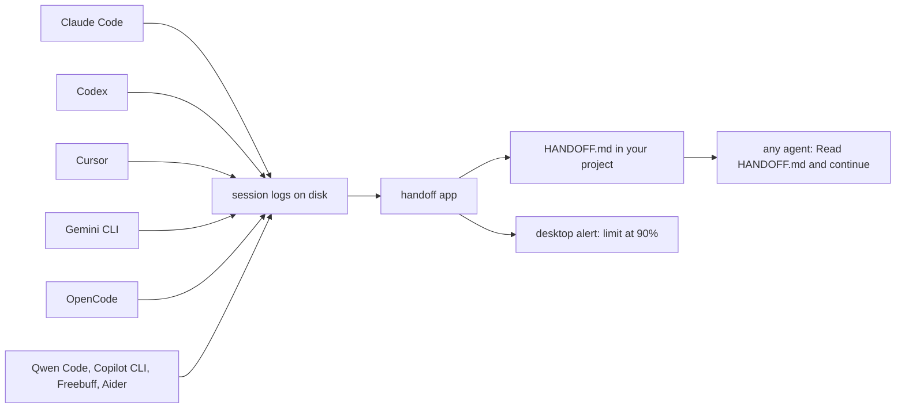

<div align="center">


# handoff

**Never lose your work when the tokens run out.**

A small background app, not a skill or a prompt, that watches your coding agents (Claude Code, Codex, Cursor, Gemini CLI, OpenCode, Qwen Code, GitHub Copilot CLI, Freebuff/Codebuff and Aider) and keeps a `HANDOFF.md` in every project, so when the context fills up, the credit runs out or the session dies, any agent can pick up exactly where you stopped.

[](https://www.python.org/)
[](pyproject.toml)
[](#what-it-reads)
[](#install)

</div>

---

## Why an app

Prompts, rules and skills only work while the agent is alive and remembers to use them. When your credit runs out, the agent is already gone, and so is everything it knew.

`handoff` doesn't ask the agent for anything. Every coding agent already saves its conversation to disk as it works. `handoff` reads those logs **from the outside** and writes the handoff itself, which is why it still works after the session has died.


```mermaid
flowchart LR
    A["Claude Code"] --> L["session logs on disk"]
    B["Codex"] --> L
    C["Cursor"] --> L
    D["Gemini CLI"] --> L
    E["OpenCode"] --> L
    G["Qwen Code, Copilot CLI, Freebuff, Aider"] --> L
    L --> H["handoff app"]
    H --> F["HANDOFF.md in your project"]
    H --> N["desktop alert: limit at 90%"]
    F --> X["any agent: Read HANDOFF.md and continue"]
```

## What it does

- **Keeps `HANDOFF.md` current.** After every step an agent finishes, the file in that project is refreshed: goal, where it stopped, the agent's own plan and recap, files changed (including those changed through shell commands and committed), commands, errors, repo state.
- **Sees the limit coming.** Codex records how much of its usage limit is used. At **80%** and **95%**, `handoff` writes the handoff immediately and shows a desktop notification, before the credit is gone.
- **Catches the cut-off.** When any agent hits a usage limit, session limit, rate limit, quota or runs out of credits, or a context window passes 70% and 85%, it writes the handoff at once and alerts you.
- **Rescues dead sessions.** `handoff now` rebuilds the handoff from the log of a session that already ended.
- **Stays out of your way.** It only writes its own marked section, masks API keys and passwords, and never writes into your home folder, temp folders or agent settings.

## Install

Python 3.8 or newer. Nothing else.

```bash
git clone https://github.com/chentaymane/handoff
cd handoff
python3 -m handoff install
```

`install` does everything in one step: it adds a `handoff` command (in `~/.local/bin` on Linux and macOS, a folder already on your PATH on Windows), starts the watcher in the background, and makes it start by itself whenever you log in. It works on systems where `pip install` is blocked, such as Ubuntu 24.04 and Debian 12. Keep the cloned folder: the command runs from it.

With pip or pipx instead: `pipx install .` (or `pip install .`), then `handoff start` and `handoff autostart on`.

## Commands

| Command | What it does |
|---|---|
| `handoff install` / `handoff uninstall` | Set everything up in one step / undo it (your HANDOFF.md files are kept) |
| `handoff dashboard` | Open the local web dashboard at http://127.0.0.1:7788 (`--port`, `--no-open`) |
| `handoff status` | Your recent agent sessions: context used, usage limit, how old each project's HANDOFF.md is, and whether the watcher runs |
| `handoff now` | Write HANDOFF.md for the current folder from its latest session, whichever agent it was (`--print` to only show it) |
| `handoff now FOLDER --from LOG` | Rebuild a handoff from one specific session log |
| `handoff start` / `handoff stop` | Run the watcher in the background / stop it |
| `handoff watch` | Run the watcher in this window, to see what it does |
| `handoff autostart on` / `off` | Start the watcher when you log in |

```
$ handoff status
Watcher:    running (pid 18244)
Autostart:  on
Reads:      Claude Code, Codex, Gemini CLI, Cursor, OpenCode, Qwen Code, Copilot CLI, Freebuff/Codebuff, Aider

LAST ACTIVE       TOOL         CONTEXT       USAGE LIMIT  HANDOFF.md  FOLDER
2026-09-16 15:38  Claude Code  55% of 1000K  -            1 min old   C:\Users\you\Desktop\shop-api
2026-09-16 14:02  Codex        40% of 258K   87% 30-day   3 min old   C:\Users\you\Desktop\uploader
2026-09-16 11:20  Cursor       41% of 200K   LIMIT HIT    9 min old   C:\Users\you\Desktop\insta-bot
2026-09-15 23:54  OpenCode     39% of 200K   -            2 h old     C:\Users\you\Desktop\scraper
```

## Dashboard

```bash
handoff dashboard
```

Opens a page in your browser, served by the app itself on `127.0.0.1` so only your computer can reach it. It shows, and refreshes every 5 seconds:

- the watcher (start or stop it) and whether it starts at login,
- every supported CLI and how many sessions each has,
- one card per project: the tool, the goal and latest request, how full the context is, the usage limit, alerts, and how old its HANDOFF.md is,
- buttons to write or refresh HANDOFF.md right now, read it, or copy the prompt that resumes the work in another CLI.

It only reads and writes in folders where one of your agents has worked, and it refuses requests from other websites.

## What it reads

| Tool | Where | Context | Usage limit |
|---|---|---|---|
| **Codex** (CLI, IDE extension, app) | `~/.codex/sessions` | exact | **percentage before you hit it**, with its reset time |
| **Claude Code** (CLI, desktop, IDE) | `~/.claude/projects` | measured, window size assumed | when a limit is hit |
| **Cursor** | `~/.cursor/projects/*/agent-transcripts` and Cursor's `state.vscdb` | exact | when a limit is hit |
| **OpenCode** | `~/.local/share/opencode/opencode.db` | measured | when a limit is hit (HTTP 429) |
| **Gemini CLI** | `~/.gemini/tmp/*/chats` | measured | when a quota is hit |
| **Qwen Code** | `~/.qwen/tmp/*/chats` | measured, window from the log | when a rate limit or quota is hit |
| **GitHub Copilot CLI** | `~/.copilot/session-state/*/events.jsonl` | when the log has it | when a rate limit is hit |
| **Freebuff** and **Codebuff** | `~/.config/manicode/projects/*/chats` | measured | when credits run out or a limit is hit |
| **Aider** | `.aider.chat.history.md` in each project | from the token report | when a rate limit is hit |
| Antigravity | — | stores conversations in a binary format, not readable yet | — |

Only Codex writes its usage percentage into its logs, so it's the one tool where `handoff` can warn you *before* the credit runs out. For the others, the handoff is kept fresh after every step, so it's already written when the limit arrives.

Claude Code, Codex, Cursor and OpenCode were tested on real sessions. The Gemini CLI, Qwen Code, Copilot CLI, Freebuff/Codebuff and Aider readers are built from those tools' source code and published formats, and tested with sample logs.

Aider keeps its log inside each project, so `handoff` looks for it one and two folders deep in your home folder and in the usual places for code (`Desktop`, `Documents`, `projects`, `code`, `src`, `dev`, `work`, `repos` and a few more). If your projects live elsewhere, set `HANDOFF_SCAN` to a list of folders, separated like `PATH`.

Claude Code also writes a short recap of the session when you step away, and a title for it. Both go into the handoff.

## What HANDOFF.md looks like

<details>
<summary>An example from a Codex session at 91% of its usage limit</summary>

```markdown
# HANDOFF: shop-api

> **Next agent:** read this file, check it against the repo with `git status`, then continue
> from "Next steps". The section below is updated automatically from the latest coding session
> in this folder; notes added outside it are kept.

<!-- handoff:auto:start -->
## Auto handoff

_Last update: 2026-09-16 15:42 +0100, from a **Codex** session (gpt-5.5)._

**Heads-up:** 91% of the usage limit is used.

### Goal
> Add Stripe checkout to the cart page and email a receipt after payment

### Where we stopped
> Checkout works end to end in test mode. The receipt email is wired up,
> but the template still has placeholder text.

### Plan
- [x] Create the checkout session endpoint
- [x] Redirect the cart page to Stripe
- [ ] **Send the receipt email** _(in progress)_
- [ ] Handle failed payments

### Next steps
1. Send the receipt email
2. Handle failed payments

### Files changed in this session
- `src/routes/checkout.ts` - added
- `src/pages/cart.tsx` - edited
- `src/emails/receipt.html` - added

### Session
- **Tool:** Codex (gpt-5.5), 48 tool calls
- **Context:** ~142K of 258K tokens (55%)
- **Usage limit:** 91% used of the 5-hour window, resets 2026-09-16 17:30

### Repo
- **Branch:** `feature/checkout` @ `4be21c9` - Add checkout session endpoint
- **Uncommitted:** 3 changed, 1 untracked
<!-- handoff:auto:end -->
```

</details>

Open the project in any agent and say **"Read HANDOFF.md and continue."**

## How it decides

- It checks the logs every 5 seconds and only acts on sessions that are active **after** it started, so it never fills old projects with files.
- It writes once an agent has been quiet for 20 seconds (a step just finished), so the file is at most one step behind.
- It writes immediately, and alerts once per level, when a usage limit or the context window crosses a threshold.
- It only writes for real work: at least one changed file, three commands, two requests, or a limit hit.
- It never writes into your home folder, a drive root, a temp folder or an agent's settings folder. Put an empty `.nohandoff` file in any project to keep it out.
- It owns only the lines between `<!-- handoff:auto:start -->` and `<!-- handoff:auto:end -->`. You and your agents can write anything above or below, and it's kept.
- It masks secrets before writing: `sk-`, `ghp_`, `AKIA`, `AIza` and `xox` keys, JWTs, `password=`-style values, and credentials in URLs.
- It opens agent databases read-only, so it can never block or change them.

Its own files live in `~/.handoff`: `handoff.log`, `state.json` and `watch.pid`. Set `HANDOFF_HOME` to put them elsewhere.

## Development

```bash
python -m unittest discover -s tests -t .
```

Each agent has one reader in `handoff/sources/` with the same three functions (`discover`, `read`, `folder`), so adding another agent means adding one file.

## Uninstall

```bash
handoff uninstall
```

Then delete the cloned folder and `~/.handoff`. If you installed with pip, also run `pip uninstall handoff-app`.
